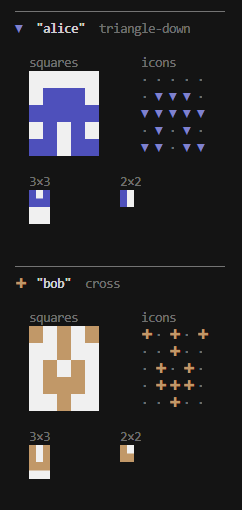
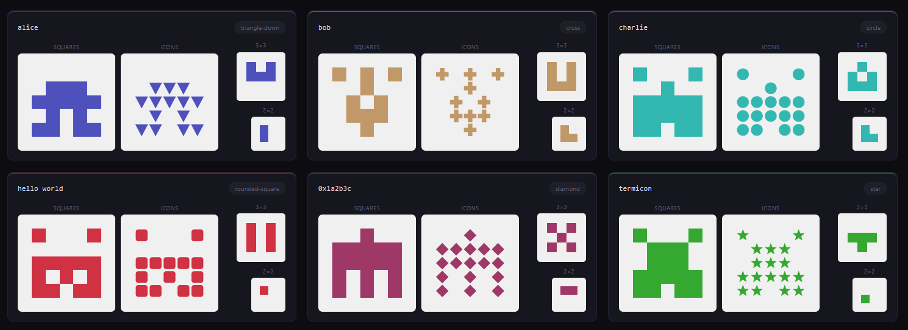

# termicon

Identicon library that works with the terminal and browser. Generates deterministic, visually distinct avatars from any string — email address, username, hash, or arbitrary text.





## Install

```sh
yarn add termicon
```

## Quick start

```ts
import { generate } from 'termicon'
import { toSvg } from 'termicon/svg'

const id = await generate('alice@example.com')
const svg = toSvg(id)
// <svg xmlns="http://www.w3.org/2000/svg" width="120" height="120">...</svg>
```

## API

### `generate(input, options?)`

Hashes the input with SHA-256 and returns an `IdenticonResult` describing the grid, color, and shape. All renderers take this result as their first argument.

```ts
import { generate } from 'termicon'

const id = await generate('alice@example.com')
// { grid: number[][], color: { h, s, l }, shape: number }
```

| Option | Type | Default | Description |
|--------|------|---------|-------------|
| `size` | `2 \| 3 \| 5` | `5` | Grid dimensions |

---

### `toSvg(id, options?)`

Returns an SVG string of squares. Works in Node.js and browsers.

```ts
import { toSvg } from 'termicon/svg'

const svg = toSvg(id)
const svg = toSvg(id, { pixelSize: 64, padding: 0 })
```

| Option | Type | Default | Description |
|--------|------|---------|-------------|
| `pixelSize` | `number` | `120` | Width and height of the output in pixels |
| `padding` | `number` | `1` | Empty cells around the grid on each side |
| `transparent` | `boolean` | `false` | Omit the background rect, making it transparent |

---

### `toIconSvg(id, options?)`

Like `toSvg` but renders cells as shapes (circle, diamond, star, hexagon, etc.) instead of squares. The shape is derived from the hash so it is stable per input.

```ts
import { toIconSvg } from 'termicon/svg'

const svg = toIconSvg(id)
const svg = toIconSvg(id, { pixelSize: 64 })
```

Accepts the same options as `toSvg`.

---

### `toCanvas(id, ctx, options?)`

Draws onto an existing `CanvasRenderingContext2D`. Works in browsers and Node.js canvas libraries. The caller is responsible for sizing the canvas to match `pixelSize` before calling.

```ts
import { toCanvas } from 'termicon/canvas'

const canvas = document.createElement('canvas')
canvas.width = canvas.height = 120
toCanvas(id, canvas.getContext('2d')!)
```

| Option | Type | Default | Description |
|--------|------|---------|-------------|
| `pixelSize` | `number` | `120` | Logical render size in pixels |
| `padding` | `number` | `1` | Empty cells around the grid |

---

### `toAnsi(id, options?)`

Returns a string with truecolor ANSI escape sequences for display in a terminal.

```ts
import { toAnsi } from 'termicon/ansi'

process.stdout.write(toAnsi(id) + '\n')
```

| Option | Type | Default | Description |
|--------|------|---------|-------------|
| `cellWidth` | `number` | `2` | Number of space characters per cell |
| `transparent` | `boolean` | `false` | Use the terminal's default background color for off-cells instead of gray |

---

### `toAscii(id, options?)`

Returns a plain-text string. Useful in environments without color support or for debugging.

```ts
import { toAscii } from 'termicon/ascii'

console.log(toAscii(id))
// #.#.#
// #####
// ##.##
// .#.#.
// .....

console.log(toAscii(id, { onChar: '█', offChar: ' ' }))
```

| Option | Type | Default | Description |
|--------|------|---------|-------------|
| `cellWidth` | `number` | `1` | Characters per cell |
| `onChar` | `string` | `'#'` | Character for on-cells |
| `offChar` | `string` | `'.'` | Character for off-cells |

---

## Browser usage

```ts
import { generate } from 'termicon'
import { toSvg } from 'termicon/svg'

document.getElementById('avatar')!.innerHTML = toSvg(await generate(email))
```

## Development

```sh
yarn install
yarn dlx @yarnpkg/sdks vscode
```

## License

[MIT](./LICENSE)
